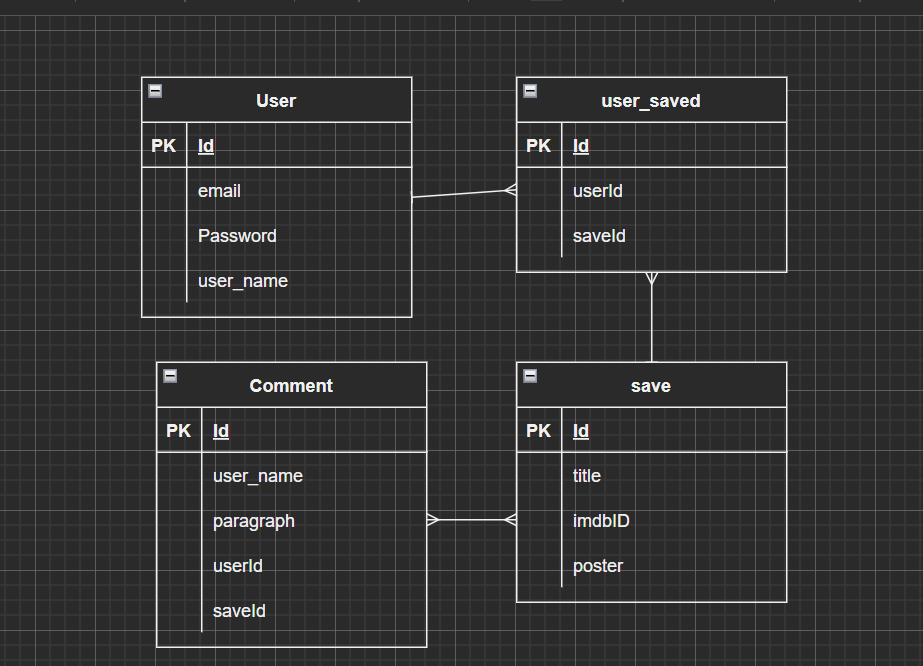
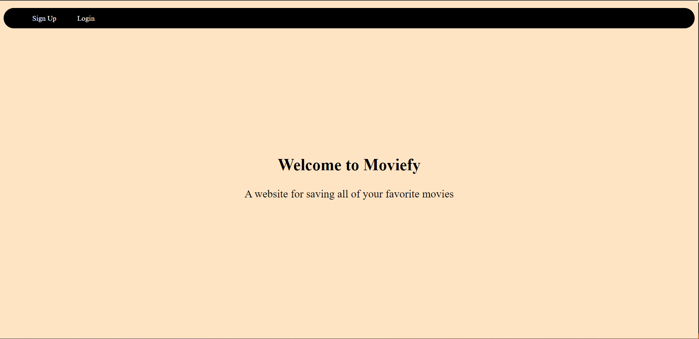
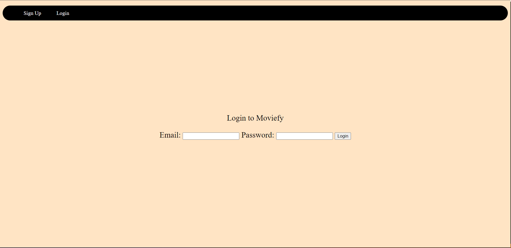
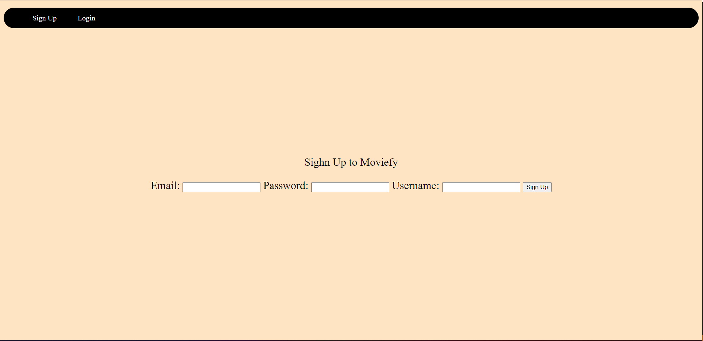
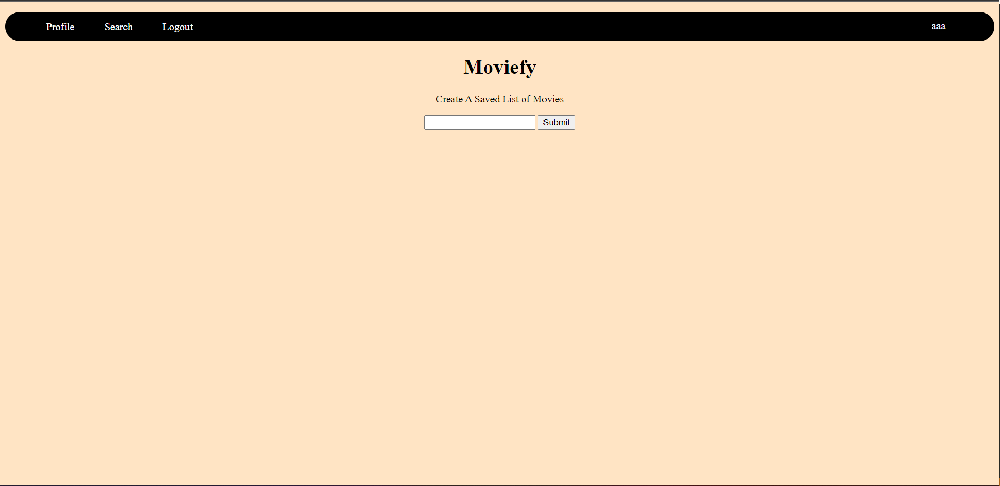
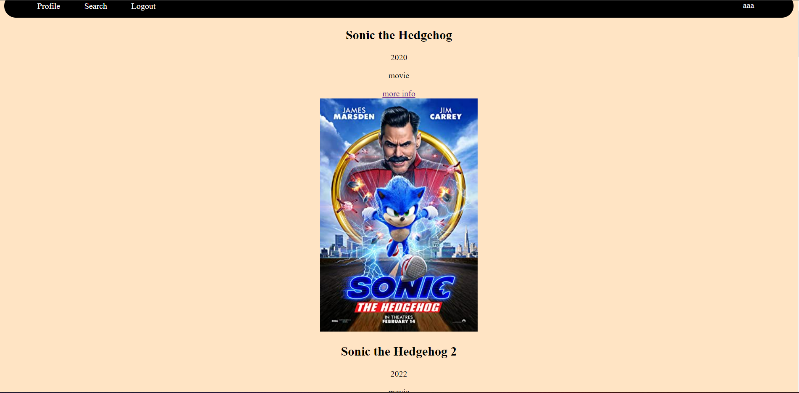
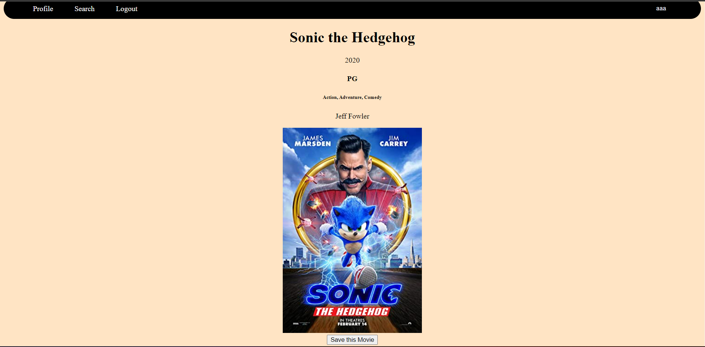

# Search Your favorite movies and keep a list of your favorites.

## Chosen Api
______
OMDB

## ERD
______

| Method | Action | URL | Functionality |
|--------|:------:|:---:|:--------------|
| GET | show | / | show homepage |
| GET | show | /users/profile | show user saved user movies |
| POST | create | /users/profile | create a new saved movie |
| delete | delete | /users/profile/:id | delete saved movies |
| POST | create | /users/profile/:id | Make a comment |
| DELETE | delete | /users/profile/:id | Delete comments |
| Get | show | /users/search | search movies|
| GET | show | /results | show search results|
| GET | detail/show | /details/:id | show one movie |

| Method | Action | URL | Functionality |
|--------|:------:|:---:|:--------------|
| GET | show | /users/new | render a form to create a new user |
| POST | create | /users | create new user |
| GET | show | /users/login | show a form to login user |
| POST |   | users/login | Use data to login user | 
| GET |   | users/logout | Log user out |
| GET | show  | users/profile | check if user is logged in |

## Wireframes of all user views
_________

### homepage

### login page

### sign up page

### search page

### results

### Movie details page

### Profile page

### 

## User Stories
________

- As a user I want to view movies
- As a user I want to save my favorite movies on my personal profile
- As a user I want to change my username from time to time

## MVP
________

 - Search a range of movies they like
 - Give users a personal profile
 - Allow user to change username
 - Allow user to save a list of personal movies they like
 - Allow users to comment on movies

 ## Stretch Goals
 _______
 - Allow user a profile pic
 - Allow users to make an slideshow out of saved movies they like
 
 ## Description
 ____
 Moviefy is a app that is used to save your favorite movies on your personal profile.

 ## Installation instructions
 ____
 - Fork and clone repository
 - Run `npm install` to install dependencies from the package.json
 - Run `createdb project2` to create the database
 - Run `sequelize db:migrate` to run migrations
 - Finally run `nodemon` to run app on server

 ## Technologies used
 - Javascript
 - HTML
 - CSS
 - Node.js
 - Method-Override
 - EJS
 - Express-EJS-Layouts
 - Dotenv
 - Crypto-JS
 - Cookie-Parser
 - Bcrypt
 - Express
 - Sequelize
 - Postgresql
 - Axios

## Approach Taken
____
It honestly was kind of a mess making this one it was just repeated trial and error

## Post Project reflections 
____
I definitely need to reach out for help more a different more informed perspective speeds things along. I feel like I have learned a lot with this project Im happy to finally be able to say that I have made a fullstack app. I also learned that while it was a struggle I enjoy backend quite a bit the problem solving of it is nice. Moving forward I definitely plan to be more vocal and to try and just dive in to my future projects a lot quicker.

## Deploy link
____
