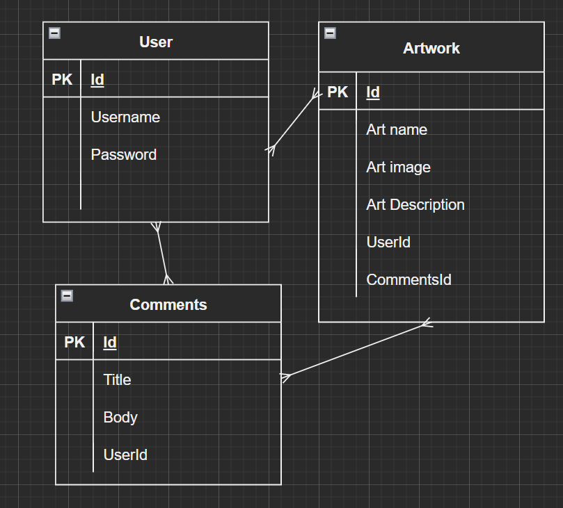

# Search Your favorite artworks and keep a list of your favorites.

## Chosen Api
______
Art Institute of Chicago https://api.artic.edu/api/v1/artworks (doesn't require key)

## ERD
______

| Method | Action | URL | Functionality |
|--------|:------:|:---:|:--------------|
| GET | show | /homepage | show homepage/login prompt |
| GET | show | /userhomepage | show user saved user artwork |
| POST | create | /sighn up | add a user |
| Get | show | /search | search artwork|
| GET | show | /results | show search results|
| GET | detail/show | /artworks/:id | show one peice of art |
| PUT | update | /artworks/:id | comment on artwork |
| PUT | update | /users | update one user |
| DELETE | delete | /artworks/:id | delete one artwork from user list |

## Wireframes of all user views
_________

### homepage

### login page

### sign up page

### search page

### results

### Art index page

### Saved art page

## User Stories
________

- As a user I want to view artwork
- As a user I want to save my favorite artwork on my personal profile
- As a user I want to change my username from time to time

## MVP
________

 - Search a range of artworks
 - Give users a persoonal profile
 - Allow user to change username
 - Allow user to save a list of personal artworks
 - Allow users to comment on artwork

 ## Stretch Goals
 _______
 - Allow user a profile pic
 - Allow users to make an slideshw out of sved artworks
 
