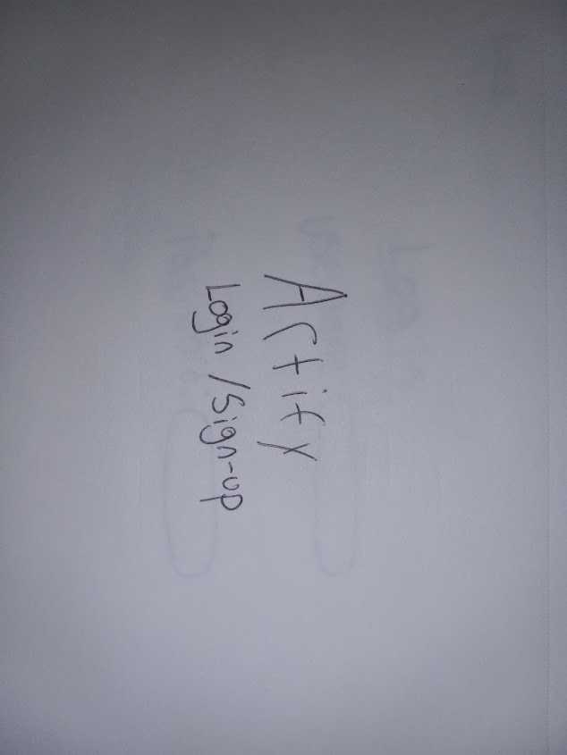
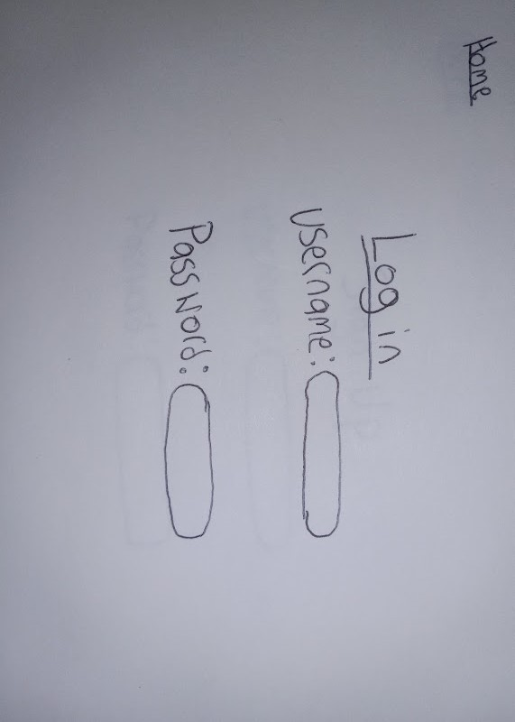
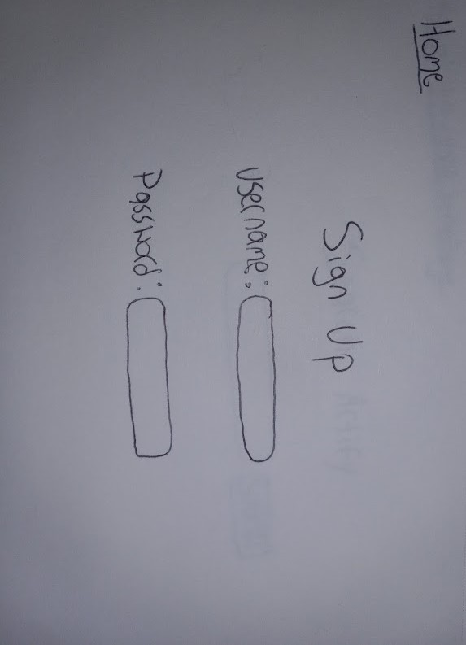
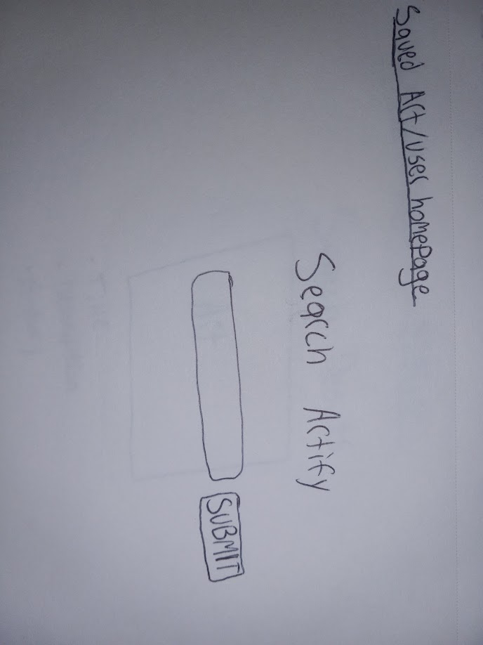
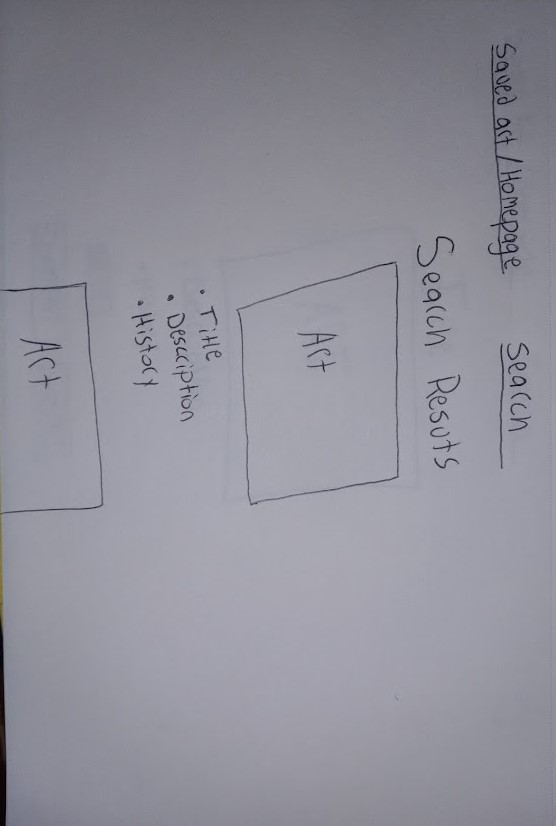
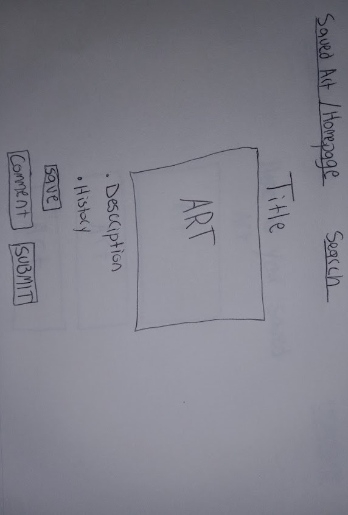
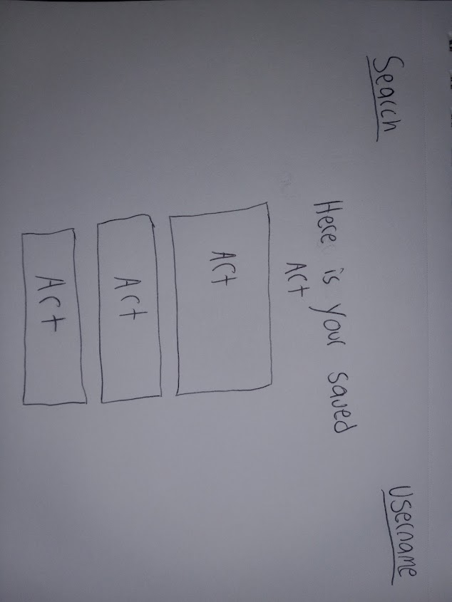

# Search Your favorite movies and keep a list of your favorites.

## Chosen Api
______
OMDB

## ERD
______

| Method | Action | URL | Functionality |
|--------|:------:|:---:|:--------------|
| GET | show | / | show homepage |
| GET | show | /users/profile | show user saved user movies |
| POST | create | /users/profile | create a new saved movie |
| delete | delete | /users/profile/:id | delete saved movies |
| POST | create | /users/profile/:id | Make a comment |
| DELETE | delete | /users/profile/:id | Delete comments |
| Get | show | /users/search | search movies|
| GET | show | /results | show search results|
| GET | detail/show | /details/:id | show one movie |

| Method | Action | URL | Functionality |
|--------|:------:|:---:|:--------------|
| GET | show | /users/new | render a form to create a new user |
| POST | create | /users | create new user |
| GET | show | /users/login | show a form to login user |
| POST |   | users/login | Use data to login user | 
| GET |   | users/logout | Log user out |
| GET | show  | users/profile | check if user is logged in |

## Wireframes of all user views
_________

### homepage

### login page

### sign up page

### search page

### results

### Art index page

### Saved art page

## User Stories
________

- As a user I want to view artwork
- As a user I want to save my favorite artwork on my personal profile
- As a user I want to change my username from time to time

## MVP
________

 - Search a range of movies they like
 - Give users a personal profile
 - Allow user to change username
 - Allow user to save a list of personal movies they like
 - Allow users to comment on artwork

 ## Stretch Goals
 _______
 - Allow user a profile pic
 - Allow users to make an slideshow out of saved movies they like
 
